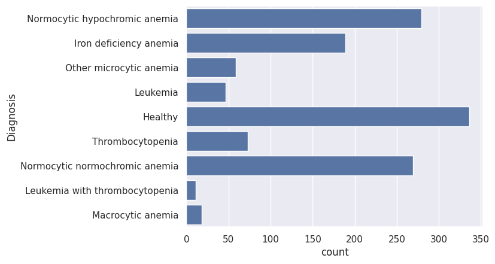

# Diagnostico de anemias com Keras


# O projeto
Esse projeto foi desenvolvido em conjunto com a formação da [Alura Deep Learning com Tensorflow e Keras](https://cursos.alura.com.br/formacao-deep-learning-tensorflow-keras), essa experiementação é uma adaptação do projeto que a instrutora fez em aula utilizando a base Iris, como eu gosto de ir fazendo com um tema do interesse em paralelo, acabei esse experimento. A ideia desse texto é compartilhar um pouco do que aprendi e as possibilidades do Keres/Tensorflow e também fortalecer o meu aprendizado. Se você chegou aqui espero que o texto seja útil, e caso você tenha correções, sugestões ou comentarios só me manda por favor, vou ficar feliz demais! 

# Objetivo
O objetivo deste projeto é desenvolver um modelo preditivo capaz de identificar diferentes tipos de anemia a partir de exames de sangue utilizando técnicas de aprendizado de máquina, mais especificamente redes neurais implementadas com a biblioteca Keras. O sistema busca automatizar o processo de diagnóstico, detectando condições como anemia por deficiência de ferro, leucemia, anemias macrocíticas, entre outras, com base em resultados de hemogramas. Por ser parte da formação citada anteriormente não foram exploradas todas as possibilidades e otimizações disponíveis, trabalhando apenas com os aspectos apresentados no curso.

# Descrição
O projeto parte de um [conjunto de dados do Kaggle](https://www.kaggle.com/datasets/ehababoelnaga/anemia-types-classification/data) contendo 1281 amostras de exames de sangue, onde cada entrada representa os resultados de exames hematológicos conforme o exemplo abaixo:

```
    'WBC': 2.740,    # Contagem de glóbulos brancos
    'LYMp': 36.9,   # Porcentagem de linfócitos
    'NEUTp': 60.0,  # Porcentagem de neutrófilos
    'LYMn': 2.0,    # Contagem absoluta de linfócitos 
    'NEUTn': 3.5,   # Contagem absoluta de neutrófilos
    'RBC': 4.77,    # Contagem de glóbulos vermelhos 
    'HGB': 13.5,    # Hemoglobina 
    'HCT': 39.7,    # Hematócrito 
    'MCV': 83.2,    # Volume corpuscular médio 
    'MCH': 28.3,    # Hemoglobina corpuscular média
    'MCHC': 320.0,  # Concentração de hemoglobina corpuscular
    'PLT': 167.0,   # Contagem de plaquetas
    'PDW': 0.15,    # Largura de distribuição de plaquetas
    'PCT': 0.02     # Proporção de plaquetas
```

Cada entrada está associada a um diagnósticos binário relacionado a diferentes tipos de anemia distribuidos da seguinte forma:




## Pré-Processamento
O dataset do Kaggle possui uma coluna “Diagnosis” onde tinha o diagnostico descritivo. Para que o modelo conseguisse ligar com essas entradas foi necessário transformar em colunas binarias(dummy). 
Citar codigo


Os dados numéricos dos exames de sangue foram normalizados usando a técnica de StandardScaler para padronizar as entradas entre valores com média 0 e desvio padrão 1. Isso se deu devido a grande amplitude entre os valores dos parâmetros dos exames. 


