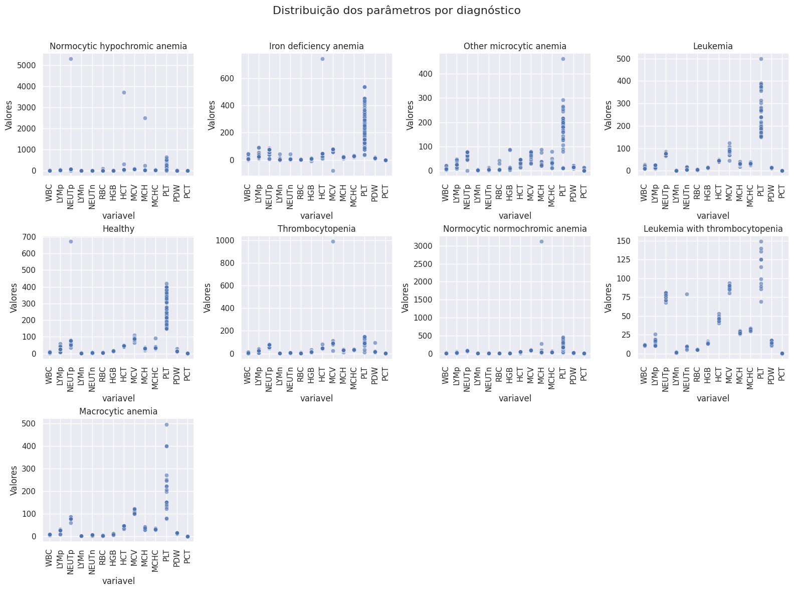
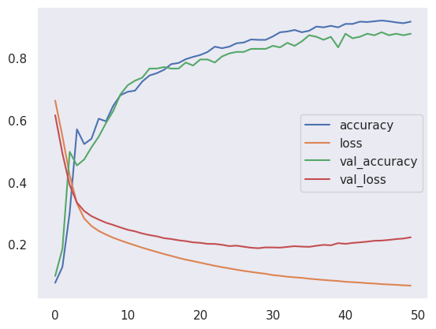
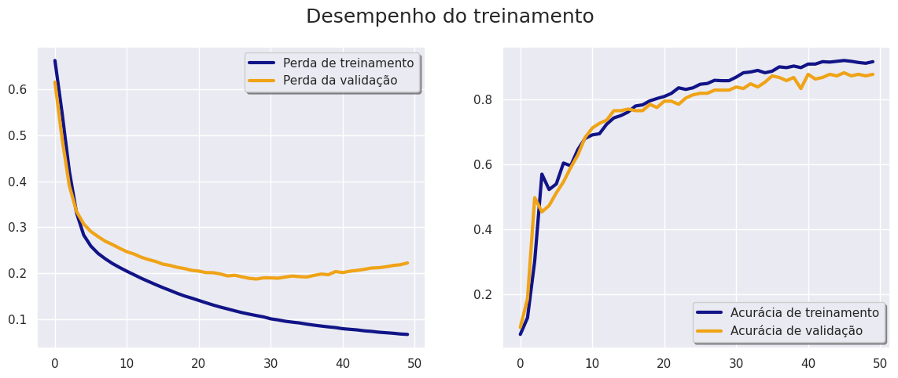

# Diagnostico de anemias com Keras


# O projeto
Esse projeto foi desenvolvido em conjunto com a formação da [Alura Deep Learning com Tensorflow e Keras](https://cursos.alura.com.br/formacao-deep-learning-tensorflow-keras), essa experiementação é uma adaptação do projeto que a instrutora fez em aula utilizando a base Iris, como eu gosto de ir fazendo com um tema do interesse em paralelo, acabei esse experimento. A ideia desse texto é compartilhar um pouco do que aprendi e as possibilidades do Keres/Tensorflow e também fortalecer o meu aprendizado. Se você chegou aqui espero que o texto seja útil, e caso você tenha correções, sugestões ou comentarios só me manda por favor, vou ficar feliz demais! 

# Objetivo
O objetivo deste projeto é desenvolver um modelo preditivo capaz de identificar diferentes tipos de anemia a partir de exames de sangue utilizando técnicas de aprendizado de máquina, mais especificamente redes neurais implementadas com a biblioteca Keras. O sistema busca automatizar o processo de diagnóstico, detectando condições como anemia por deficiência de ferro, leucemia, anemias macrocíticas, entre outras, com base em resultados de hemogramas. Por ser parte da formação citada anteriormente não foram exploradas todas as possibilidades e otimizações disponíveis, trabalhando apenas com os aspectos apresentados no curso.

# Descrição
O projeto parte de um [conjunto de dados do Kaggle](https://www.kaggle.com/datasets/ehababoelnaga/anemia-types-classification/data) contendo 1281 amostras de exames de sangue, onde cada entrada representa os resultados de exames hematológicos conforme o exemplo abaixo:

```
    'WBC': 2.740,    # Contagem de glóbulos brancos
    'LYMp': 36.9,   # Porcentagem de linfócitos
    'NEUTp': 60.0,  # Porcentagem de neutrófilos
    'LYMn': 2.0,    # Contagem absoluta de linfócitos 
    'NEUTn': 3.5,   # Contagem absoluta de neutrófilos
    'RBC': 4.77,    # Contagem de glóbulos vermelhos 
    'HGB': 13.5,    # Hemoglobina 
    'HCT': 39.7,    # Hematócrito 
    'MCV': 83.2,    # Volume corpuscular médio 
    'MCH': 28.3,    # Hemoglobina corpuscular média
    'MCHC': 320.0,  # Concentração de hemoglobina corpuscular
    'PLT': 167.0,   # Contagem de plaquetas
    'PDW': 0.15,    # Largura de distribuição de plaquetas
    'PCT': 0.02     # Proporção de plaquetas
```

Cada entrada está associada a um diagnósticos binário relacionado a diferentes tipos de anemia distribuidos da seguinte forma:


## Pré-Processamento
O dataset do Kaggle possuía uma coluna chamada “Diagnosis”, contendo os diagnósticos de forma descritiva. Para que o modelo pudesse lidar com essas informações, foi necessário transformar essa coluna em variáveis binárias (dummies).

```
diagnosis_dummies = pd.get_dummies(df['Diagnosis'])
df = pd.concat([df, diagnosis_dummies], axis=1)

```


Os dados numéricos dos exames de sangue foram normalizados utilizando a técnica de StandardScaler, que padroniza os valores com média 0 e desvio padrão 1. Essa normalização foi necessária devido à grande amplitude entre os parâmetros dos exames de sangue.


Gráfico com os dados não normalizados.

## Modelo

A criação do modelo e suas definições iniciais foram feitas utilizando o método [`keras.Sequential`](https://keras.io/api/models/sequential/) do Keras, que permite a definição de camadas como  [`Dense`](https://keras.io/api/layers/core_layers/dense/) que são totalmente conectadas. Cada camada contém um número definido de neurônios; neste caso, foram utilizadas duas camadas com 64 e 32 neurônios, respectivamente.

```
model = Sequential()

model.add(Input(shape=(X_train.shape[1],)))
model.add(Dense(64, activation='relu'))
model.add(Dense(32, activation='relu'))
model.add(Dense(Y_train.shape[1], activation='sigmoid'))

```

Aquilo que chamamos de "neuronios" são denominados perceptrons, eles são a estrutura básica dos modelos de deep learning, considerado o "átomo" de uma rede neural. Ele é composto por uma entrada, um processamento e uma saída, mimetizando de forma simbólica as funções de um neurônio biológico (dendritos, axônio e terminais sinápticos). Esse processamento é expresso pela equação:


$$
y = f(\mathbf{w} \cdot \mathbf{x} + b)
$$


- y = saida
- f = funçaõ de ativação
- w = pesos
- x = entrada
- b = vies(bias)

Na prática, com o Keras, a definição da camada Dense corresponde basicamente à definição dos termos dessa equação, da seguinte forma:

**X (Entradas):** Refere-se à quantidade de "colunas" ou variáveis de entrada que irão alimentar o "neurônio", ou seja, os valores que serão usados para calcular e fazer a inferência, correspondendo às entradas do perceptron. Esse termo é definido na primeira linha do `keras.Sequential` com `Input(shape=X)`.

**W (Pesos):** Existe um peso para cada entrada que o modelo recebe. Cada peso é um valor (ou coeficiente) que multiplica a entrada correspondente, conforme descrito na equação. No Keras, os pesos são inicializados pelo parâmetro [`keras.initializers`](https://keras.io/api/layers/initializers/), onde existem várias opções de inicialização. Caso não seja especificado, eles serão iniciados com [`glorot_uniform`](https://github.com/tensorflow/tensorflow/blob/master/tensorflow/python/keras/layers/core.py).

**b (Viés):** O viés é semelhante aos pesos, mas ele é somado ao produto das entradas e dos pesos, permitindo mais flexibilidade ao modelo. Isso garante que, mesmo que as entradas sejam zero, a saída não seja necessariamente zero. No Keras, o viés é inicializado pelo parâmetro `bias_initializer`, que por padrão é inicializado com zeros.

**Y (Saída):** A última camada define a saída, que no nosso caso foi definida com 9 unidades, correspondendo ao número de saídas (diagnósticos) presentes no dataset.

Após a definição desses parâmetros, o próximo passo é a função soma: Ela agrega os valores das entradas multiplicadas pelos pesos, gerando o "valor de ativação", que será passado para a função de ativação. Esse processo não é um parâmetro da camada Dense, mas ocorre automaticamente dentro dela.

**Função de Ativação:** Ela recebe o valor de ativação e gera a saída. As camadas ocultas usam a função de ativação ReLU (Retificação Linear), enquanto a camada de saída utiliza a função sigmoid, que é adequada para problemas de classificação multirrótulo (multilabel).

- ReLu - A função relu de retificação linear executa uma ação bem simples, se o valor é negativo tem como saída 0 e se for positivo é devolvido o próprio valor. A ReLu é mais comumente usada por ser computacionalmente eficiente e também conseguir lidar bem com o [problema de gradiente desaparecido](https://www.deeplearningbook.com.br/o-problema-da-dissipacao-do-gradiente/) que de forma resumida é quando os valores os valores dos gradientes, que são necessários para atualizar os pesos durante o aprendizado, se tornam muito pequenos, tornando o processo de aprendizado lento ou ineficaz.

``` activation='relu' ```

- Sigmoid - A função Sigmoid transforma qualquer valor de entrada em um valor entre 0 e 1, o que a torna ideal para problemas de classificação binária. Valores grandes se aproximam de 1, e valores pequenos se aproximam de 0, permitindo que a saída seja interpretada como uma probabilidade.

``` activation='sigmoid' ```

- Softmax - A função Softmax é usada em redes neurais para problemas de classificação multiclasse. Ela transforma um conjunto de valores de entrada em probabilidades, distribuindo-as de forma que a soma seja igual a 1. Cada saída representa a probabilidade de pertencer a uma das classes, sendo a mais alta geralmente a previsão do modelo.

``` activation='sigmoid' ```

**O aprendizado aconteça nas funções de somas e ativação**

Após a construção e execução do código vamos ter criado a estrutura do modelo, o Keras oferece um método chamado summary() onde é possível visualizar as suas características:

```
Model: "sequential"
┏━━━━━━━━━━━━━━━━━━━━━━━━━━━━━━━━━━━━━━┳━━━━━━━━━━━━━━━━━━━━━━━━━━━━━┳━━━━━━━━━━━━━━━━━┓
┃ Layer (type)                         ┃ Output Shape                ┃         Param # ┃
┡━━━━━━━━━━━━━━━━━━━━━━━━━━━━━━━━━━━━━━╇━━━━━━━━━━━━━━━━━━━━━━━━━━━━━╇━━━━━━━━━━━━━━━━━┩
│ dense (Dense)                        │ (None, 64)                  │             960 │
├──────────────────────────────────────┼─────────────────────────────┼─────────────────┤
│ dense_1 (Dense)                      │ (None, 32)                  │           2,080 │
├──────────────────────────────────────┼─────────────────────────────┼─────────────────┤
│ dense_2 (Dense)                      │ (None, 9)                   │             297 │
└──────────────────────────────────────┴─────────────────────────────┴─────────────────┘
 Total params: 3,337 (13.04 KB)
 Trainable params: 3,337 (13.04 KB)
 Non-trainable params: 0 (0.00 B)

```
Os valores são calculados da seguinte forma

Valor anterior * neurônios + neurônios

A primeira linha com 960 parâmetros se refere:

14(entrada) * 64(neurônios) + 64 (neurônios) = 960

64 * 32 + 32 = 2080

32 * 9 + 9 = 297

## Treinamento

Para o treinamento, o primeiro passo é compilar o modelo, através do método [`.compile()`](https://keras.io/api/models/model_training_apis/) onde são ajustados os parâmetros do modelo.


```
model.compile(optimizer='adam', loss='binary_crossentropy', metrics=['accuracy'])

```
------------

**Otimizador:**

Otimizadores são algoritmos usados dentro do modelo para efetuar o treinamento. Com base na função de perda (diferença entre o resultado correto que o modelo deveria devolver e o predito), os valores de pesos e vieses são ajustados para melhorar a eficiência do modelo.

- Essa abordagem é chamada de gradiente descendente. Em suma, em cada etapa, este método verifica, para cada parâmetro, para que lado a perda do conjunto de treinamento se moveria se você perturbasse esse parâmetro apenas um pouco. Em seguida, atualiza o parâmetro na direção que pode reduzir a perda. [Dive into Deep Learning, 1.2.4. Algoritmos de Otimização](https://pt.d2l.ai/chapter_introduction/index.html?highlight=fun%C3%A7%C3%A3o%20de%20perda#algoritmos-de-otimizacao)

Existem diversos tipos de otimizadores. No [Keras são disponibilizados 12 tipos](https://keras.io/api/optimizers/). Os algoritmos mais comuns são o Adam, SGD, RMSProp e AdaGrad. De maneira geral:

- Adam é uma escolha padrão que funciona bem em muitos problemas.
- SGD é útil para grandes conjuntos de dados e é a base de muitos otimizadores modernos.
- RMSProp é adequado para redes neurais recorrentes (RNNs).
- AdaGrad é útil para dados esparsos. (RUDER, 2016)

Durante o projeto, tentei inicialmente com RMSProp, que foi proposto no curso, mas acabei ficando com o Adam devido aos resultados um pouco melhores. Não foi uma grande diferença, mas os resultados foram melhores.

------------

**Perda:**

A perda ou função de perda é um componente do modelo que mede a discrepância entre as previsões do modelo e os valores esperados. Quando treinamos um modelo, o objetivo principal é diminuir a função de perda, de forma que o modelo faça previsões mais precisas. A função, como entrada, recebe as previsões do modelo e os valores reais, retornando um valor escalar que representa o erro. Esse valor é então utilizado pelo otimizador para ajustar os pesos da rede neural, em um processo iterativo de tentativa de redução do erro (GOODFELLOW, 2016, p. 82-83).

Existem diversas funções de perda, sendo divididas em 3 grupos: perdas probabilísticas, perdas de regressão e Hinge Losses. O Keras dispõe de uma lista de funções que podem ser implementadas na compilação, que podem ser [consultadas na documentação](https://keras.io/api/losses/). Neste caso, foi utilizada a "binary crossentropy" pois foi realizado o processo de get_dummies, logo o modelo faz uma classificação binária dizendo se as entradas pertencem ou não a determinada categoria.

------------

**Metricas:** 

A definição da métrica é um fator fundamental em um modelo, pois é a partir dela que, futuramente, serão realizadas otimizações, sempre usando os seus resultados como guia. Dessa forma, determinar os objetivos em termos de qual métrica utilizar é sempre um primeiro passo necessário (GOODFELLOW, 2016, p. 422).

Neste projeto, foi escolhida a métrica de acurácia para entender quantas vezes um determinado resultado de exame foi diagnosticado corretamente. [Opções de metricas do Keras](https://keras.io/api/metrics/)

$$
{Acurácia} = \frac{\text{ Número de diagnósticos corretos }}{\text{ Total de diagnósticos }}
$$

### Fit Model

Após a compilação do modelo é executado de fato o treinamento:

    epocas=50
    historico = model.fit(X_train, Y_train, epochs=epocas, batch_size=32, validation_split=0.2)

**Épocas e batch size:**

A definição das épocas no treinamento significa a quantidade de vezes que o modelo vai percorrer todos os dados para realizar o treinamento e atualizar os pesos e vises. Porém não vão ser percorridos todos os dados de uma vez só, esses dados vão ser processados em lotes, os batchs. No nosso caso foram definidos inicialmente 50 épocas com um batch_size de 32 isso quer dizer que com um total de 1280 amostras vamos ter o seguinte comportamento: 

- a cada época, o modelo processará 1280 ÷ 32 = 40 batches.
-  O modelo ajusta seus pesos 40 vezes por época (após cada batch de 32 amostras).
-  Após 50 épocas, o modelo terá ajustado os pesos 50 × 40 = 2000 vezes. 

**Validation_Split:** Parâmetro que defini a quantidade de dados que vão ser utilizados no processo de validação do modelo. 

## Validação


Aqui está a correção ortográfica:

Após o treino do modelo, partimos para o processo de validação, verificando a perda e a acurácia do modelo em relação aos dados de teste e validação que definimos anteriormente. Podemos observar que, ao executar o treino do modelo, salvamos sua saída em uma variável `historico`,o que possibilita a utilização do método [`history`](https://keras.io/api/models/model_training_apis/#:~:text=Returns,values%20(if%20applicable).) sse método retorna os valores de perda e os valores de métrica do modelo (no nosso caso, "accuracy"). Ele retorna um dicionário, o que permite que plotemos os resultados em gráficos, facilitando assim a visualização dos resultados do modelo.

- Gráficos concatenados usando o seaborn direto no history




- Gráficos separados usando a uma função para construir o plot.




Além dos gráficos também é possível testar o modelo e visualizar uma analise resumida pelo método `evaluate` que apresenta o seguinte retorno:

```
9/9 ━━━━━━━━━━━━━━━━━━━━ 0s 2ms/step - accuracy: 0.8223 - loss: 0.0934 Loss: 0.08661733567714691, Accuracy: 0.844357967376709 
```

Utilizando os resultados da perda e acurácia no treino e validação podemos ter uma orientação de quais ajustes que fizemos impactam o modelo. Se você [olhar no notebook](Keras_diagnostico_de_anemias.ipynb) do projeto vai ver que tentei fazer algumas mudanças no “chute” mesmo para testar diferentes valores dos parâmetros. Existem técnicas mais estruturadas para busca de parametros por tentativa e erro como o Random Search e Grid Search e que no Keras fazem parte do [KerasTuner](https://keras.io/api/keras_tuner/tuners/) que ajuda na otimização dos modelos buscando os melhores hiperparametros.

# Testando o modelo

Para testar o modelo eu separei alguns dados do próprio dataset de forma manual, extraindo esses dados antes de dar início ao projeto. A exibição dos resultados de hemograma pode ser um pouco diferente, não os resultados, mas somente sua exibição. Dependendo do sistema de interface, da metodologia no laboratório e do equipamento no qual eles foram feitos pode ser que seja realizado com ou sem diferencial, e já tenha os valores calculados. Os resultados utilizados para teste são de um hemograma sem diferencial. 

```
# exame = {
#     'WBC': 2.740,   # Contagem de glóbulos brancos
#     'LYMp': 36.9,   # Porcentagem de linfócitos
#     'NEUTp': 60.0,  # Porcentagem de neutrófilos
#     'LYMn': 2.0,    # Contagem absoluta de linfócitos
#     'NEUTn': 3.5,   # Contagem absoluta de neutrófilos
#     'RBC': 4.77,    # Contagem de glóbulos vermelhos
#     'HGB': 13.5,    # Hemoglobina
#     'HCT': 39.7,    # Hematócrito
#     'MCV': 83.2,    # Volume corpuscular médio
#     'MCH': 28.3,    # Hemoglobina corpuscular média
#     'MCHC': 320.0,  # Concentração de hemoglobina corpuscular
#     'PLT': 167.0,   # Contagem de plaquetas
#     'PDW': 0.15,    # Largura de distribuição de plaquetas
#     'PCT': 0.02     # Proporção de plaquetas
# }

exame1 = {
    'WBC': 8.67,
    'LYMp': 25.8,
    'NEUTp': 77.5,
    'LYMn': 1.88,
    'NEUTn': 5.14,
    'RBC': 3.58,
    'HGB': 10.2,
    'HCT': 46.1,
    'MCV': 102.8,
    'MCH': 28.5,
    'MCHC': 27.7,
    'PLT': 272,
    'PDW': 14.31,
    'PCT': 0.26
}

amostra_exame = pd.DataFrame([exame])
amostra_exame_normalizada = scaler.transform(amostra_exame)
```

Esses resultados estavam identificados no dataset como saudável(exame) e  anemia normocítica e normocrômica(exame1). Como esse é um projeto de aprendizagem e experimentação da biblioteca eu não fui tão a fundo na validação dos resultados e valores, apenas utilizei algumas indicações do Manual de interpretação do Failace para manter o mínimo de coerência. 

Na célula junto com o dicionário dos resultados também está a transformação para um dataframe  e a normalização dos valores para ficar de acordo com o formato que foi utilizado para o treinamento do modelo. Após realizar essas transformações utilizamos o método [`predict()`](https://keras.io/api/models/model_training_apis/#:~:text=Generates%20output%20predictions%20for%20the%20input%20samples) para gerar a saída do modelo.
Na linha abaixo observamos que há uma transformação na variável que salva a saída de model.predict:

    predictions = (predictions > 0.5).astype(int)

Como utilizamos as funções de saída sigmoid ou softmax(ver testes) ambas retornam uma probabilidade de os valores de entrada pertencer a uma determinada classe. Nessa situação em específico está fazendo um arredondamento para 0 ou 1 dependendo da probabilidade predita. A ideia com essa transformação é criar um array com valores binários referente a cada um dos diagnósticos, de forma que fique mais fácil a visualização da saída.  Em uma situação real seria necessário um modelo com maior acurácia para aumentar esse valor  de arrendondamento para garantia a precisão das previsões. 

Após isso fizemos uma lista com os diagnósticos presentes no dataset:
```
# Nomes das colunas de diagnóstico
diagnosis_columns = [
    'Diagnosis_Healthy', 'Diagnosis_Iron deficiency anemia',
    'Diagnosis_Leukemia', 'Diagnosis_Leukemia with thrombocytopenia',
    'Diagnosis_Macrocytic anemia', 'Diagnosis_Normocytic hypochromic anemia',
    'Diagnosis_Normocytic normochromic anemia', 'Diagnosis_Other microcytic anemia',
    'Diagnosis_Thrombocytopenia'
]
```
Utilizamos a função zip para combinar a lista dos resultados e as predições do modelo e com um laço simples podemos exibir os resultados de saída

```
# Exibir as previsões
for col, pred in zip(diagnosis_columns, predictions[0]):
    print(f"{col}: {'Positivo' if pred == 1 else 'Negativo'}")
```

Tendo com saída para os dicionarios:

Exame:

    Diagnosis_Healthy: Positivo
    Diagnosis_Iron deficiency anemia: Negativo
    Diagnosis_Leukemia: Negativo
    Diagnosis_Leukemia with thrombocytopenia: Negativo
    Diagnosis_Macrocytic anemia: Negativo
    Diagnosis_Normocytic hypochromic anemia: Negativo
    Diagnosis_Normocytic normochromic anemia: Negativo
    Diagnosis_Other microcytic anemia: Negativo
    Diagnosis_Thrombocytopenia: Negativo

Exame1:

    Diagnosis_Healthy: Negativo
    Diagnosis_Iron deficiency anemia: Negativo
    Diagnosis_Leukemia: Negativo
    Diagnosis_Leukemia with thrombocytopenia: Negativo
    Diagnosis_Macrocytic anemia: Negativo
    Diagnosis_Normocytic hypochromic anemia: Positivo
    Diagnosis_Normocytic normochromic anemia: Negativo
    Diagnosis_Other microcytic anemia: Negativo
    Diagnosis_Thrombocytopenia: Negativo

Se você chegou até aqui, parabéns! E obrigado por ter dedicado esse tempo para acompanhar meu processo de aprendizagem e minhas experimentações com o Keras. Novamente, se você tiver dicas, observações ou apenas queira conversar sobre só me chamar, vou ficar feliz de poder trocar com pessoas que se interessam pelo assunto. 🙏🏽

# Referencias

GOODFELLOW, Ian; BENGIO, Yoshua; COURVILLE, Aaron. Deep Learning. MIT Press, 2016.

RUDER, Sebastian. An Overview of Gradient Descent Optimization Algorithms. arXiv, 2016. Disponível em: https://arxiv.org/abs/1609.04747. Acesso em: 14 out. 2024

Dive into Deep Learning - Interactive deep learning book with code, math, and discussions
https://pt.d2l.ai/index.html

Deep Learning Book Brasil
https://www.deeplearningbook.com.br/

‌FAILACE, R. Hemograma: manual de interpretação. [s.l.] Artmed Editora, 2015.
